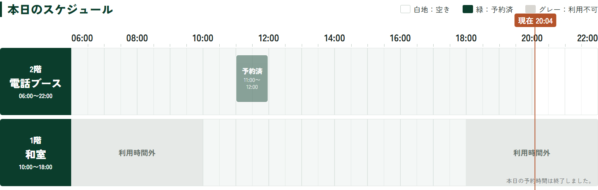
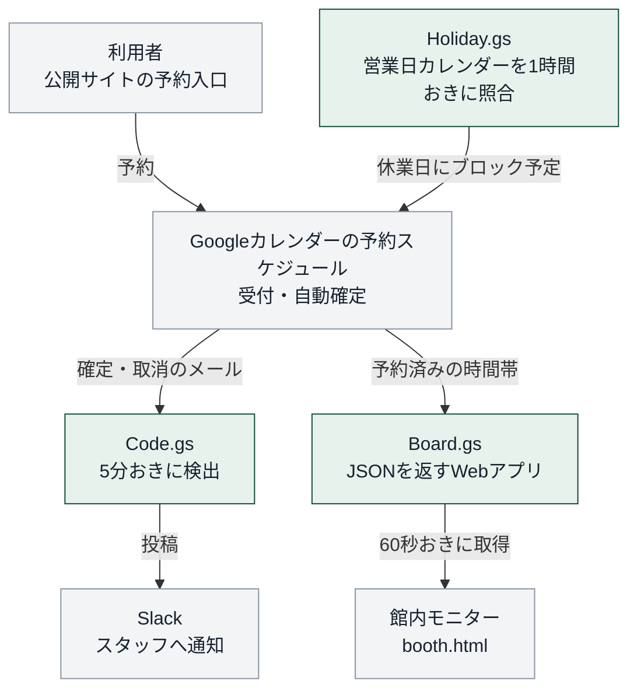
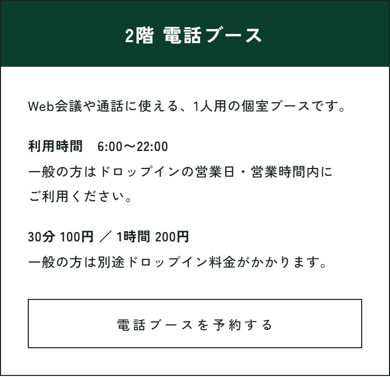

# booth-notify

コワーキングスペースの個室ブース予約を、**電話とホワイトボードからWeb予約へ置き換えた**ときのコード（Google Apps Script）。

予約の受付そのものは Googleカレンダーの「予約スケジュール」に任せている。このリポジトリは、その周りに足した **Slack通知・館内モニター用のデータ・休業日ブロック** の3つを収める。

館内モニターの予定表（<a href="https://in-light.jp/booth.html">in-light.jp/booth.html</a>）。2026年10月7日に撮影。

## 解決した課題

| | 導入前 | 導入後 |
|---|---|---|
| 予約の受付 | 経営者が電話・メールで受けていた。会議中は電話に出られないことがあった | 公開サイトから予約すると、その場で自動確定する。確定と取消はSlackへ通知する |
| 空き状況の掲示 | ホワイトボードへ手書きしていた | 館内モニターへ自動で表示する |

受付が経営者ひとりの時間に依存していた状態を、仕組みに置き換えた。

## 実績

- 公開から約1か月半で **80枠・延べ40時間分** の予約を受け付けた（2026年9月14日集計。試用と翌日以降の日程を除く。40時間は予約された時間の合計）
- 導入前は電話受付で記録が残っておらず、前後の比較はできない
- 導入時の追加費用は0円。GAS・Googleカレンダー・Slackの無料枠と、店にあったモニターを使った

## 仕組み

緑がこのリポジトリのコード、灰色は既存のサービスと店舗サイト側のページ。

| ファイル | 役割 | 動く間隔 |
|---|---|---|
| `Code.gs` | 予約の確定・取消メールを見つけてSlackへ投稿する | 5分おき |
| `Board.gs` | 予約済みの時間帯をJSONで返すWebアプリ。館内モニターのページが読む | モニターが60秒おきに取得。応答は30秒キャッシュ |
| `Holiday.gs` | 営業日カレンダーに「営業日」が無い平日を休業日とみなし、予約枠を塞ぐ予定を作る。営業日に戻れば外す | 1時間おき |

館内モニターのページ（`booth.html`）は店舗サイト側にあり、このリポジトリには含まない。

公開サイトの予約入口（<a href="https://in-light.jp/coworking.html#booth">in-light.jp/coworking.html#booth</a>）。2026年10月7日に撮影。

## 大事にしたこと

### 1. 重複予約を防ぐ処理は自作しない

顧客が実際に予約する仕組みなので、予約が重ならないことを最優先にした。重複を防ぐ処理を新しく書く代わりに、Googleカレンダーの予約スケジュールをそのまま入口にしている。

予約スケジュールは、カレンダーに予定がある時間帯を予約枠に出さない。この動きは導入前の検証（2026年7月13日）で確かめた。休業日ブロックも同じ性質を使い、休業日に予定を1件置くことで枠を消している。

### 2. 経営者の手間を利用者やスタッフへ移さない

外の人は電話の代わりにサイトで予約する。店内の人は館内モニターで空きを確かめる。経営者は普段使うSlackで通知を受け取る。

予約は自動で確定するので、Slackの通知は事後の報告にあたる。通知を見逃しても予約は成立している。

### 3. 通知を取りこぼさない

- Slackへの投稿が成功したメールにだけ、Gmailのラベルを付ける。失敗したメールにはラベルが付かず、5分後の実行でもう一度送る
- 件名の形が変わって予約者名や日時を読み取れないときは、件名をそのまま流す
- 通知メールは送信元で決め打ちせず、件名で検出する（理由は下の表の7月31日）

### 4. 予約者名を外へ出さない

モニター用のWebアプリは公開URLで動く。予約者名は、URLに付けたキーがスクリプトプロパティと一致した応答にしか含めない。キーを付けるのは店内モニターのURLの1か所。

キャッシュも「名前あり」と「名前なし」の2系統に分け、名前なしの応答へ名前が混ざらないようにしている。

### 5. 失敗したときの動きを先に決める

- モニター用のWebアプリは、予約の読み取りに失敗しても `ok:false, busy:[]` を返す。モニターは枠組みを表示し続ける
- 予約の読み取りは CalendarApp が主経路で、失敗したら公開ICSへ切り替える（この経路では名前が出ない）
- 休業日ブロックは、営業日が1日も読めないときは何も作らない。読み取りの失敗で平日をすべて塞がないための安全弁
- 休業日にすでに予約が入っていたら、Slackへ警告を出す（同じ予約への警告は1回）

## 運用で起きたことと直したこと

| 日付 | 起きたこと | 直したこと |
|---|---|---|
| 2026-07-31 | 通知メールの検出が0件になった。送信元が想定と違い、カレンダーの所有者アカウント自身だった | 件名で検出する方式に変えた |
| 2026-08-02 | モニターのページから公開ICSを直接読めなかった（CORSヘッダが無い） | GASを1枚挟み、JSONに変換して渡す形にした |
| 2026-08-05 | 臨時休業日に予約が3件入った | 同じ日に休業日ブロックのコード（`Holiday.gs`）を追加した。モニターへの反映も速めた（キャッシュ60秒→30秒） |
| 2026-08-07 | モニターに予約者名を出したいが、公開URLでは誰でも見られてしまう | 予約の読み取りをCalendarAppへ変え、名前はキーが一致した応答に限った |

## 開発の進め方（生成AIの利用）

このコードは生成AI（Claude）と作った。分担は次のとおり。

**自分が担当したこと**

- 現場の課題の把握と、解決の方針
- 予約の重複を避けることを重視し、Googleカレンダーの既存予約機能を使う案について、根拠を生成AIに調査させたうえで採用した
- 利用者が予約を終えるまでの流れの検討
- デモを操作し、意図と違う点の修正を依頼した

**生成AIに委ねたこと**

- 構成の設計・実装・テスト・コード確認・運用の技術作業（主に生成AI）

## 稼働状況

| 機能 | 担うもの | 状況 |
|---|---|---|
| 予約の受付・自動確定 | Googleカレンダーの予約スケジュール | 2026年7月31日に公開 |
| Slack通知 | `Code.gs` | 2026年7月31日から稼働 |
| 館内モニター | `Board.gs` | 2026年8月2日から表示 |
| 休業日ブロック | `Holiday.gs` | 2026年8月5日にコードを追加。本番で動かすには `setupHoliday()` の実行と権限の再承認が要る |

コードは2026年8月時点のもの。

## 設置と運用

### スクリプトプロパティ

GASエディタの「プロジェクトの設定」で設定する。

| キー | 内容 | 必須 |
|---|---|---|
| `SLACK_BOT_TOKEN` | Bot User OAuth Token（`xoxb-…`） | ✅ |
| `SLACK_CHANNEL_ID` | 投稿先チャンネルID（`C…`） | ✅ |
| `SLACK_MENTION_USER_ID` | 通知でメンションする人のメンバーID（`U…`）。未設定ならメンションなし | 任意 |
| `BOOTH_ICS_URL` | 予約カレンダーの公開ICS URL（CalendarApp が失敗したときの予備経路） | ✅ |
| `OPEN_DAYS_ICS_URL` | 営業日カレンダーの公開ICS URL | ✅ |
| `BOARD_STAFF_KEY` | 店内モニターにだけ予約者名を出すためのキー文字列 | 任意 |

### 設置手順

1. 予約用のGoogleアカウントでGASプロジェクトを作り、3つの `.gs` と `appsscript.json` を入れる（`clasp push` でも可）
2. 上のスクリプトプロパティを設定する
3. `setup()` を実行する（Gmailラベルの作成と5分トリガー）
4. `setupHoliday()` を実行する（カレンダー権限の承認と1時間トリガー）
5. `Board.gs` を「ウェブアプリ・アクセスできるユーザー＝全員」でデプロイし、そのURLをモニター側のページに設定する

### 動作確認

| 関数 | 確かめること |
|---|---|
| `test()` | プロパティの有無、Gmail検索、Slack投稿。Slackにテスト通知が1件届く |
| `testBoardFeed()` | モニター用の応答を、名前なし・名前ありの両方で実行ログに出す |
| `testHolidayParse()` | カレンダーへ書き込まずに、営業日と休業日の判定を実行ログに出す |

### 運用で踏んだ落とし穴

- **`clasp push` では本番のWebアプリに反映されない**。`/exec` はバージョン固定なので、`clasp deploy -i <デプロイID>` でバージョンを進める。反映は応答の `rev`（`BOARD_CODE_REV`）で確かめる
- **`clasp deploy` でバージョンを進めると、匿名アクセスが403になることがある**。GASエディタの「デプロイを管理」で設定を変えずに「デプロイ」を押し直すと数秒で戻る
- スコープを増やした push の後は、再承認するまで既存のトリガーも止まる。ラベル方式なので通知は失われず、再承認後に自動で追いつく

### トラブルシュート

- 通知が来ないときは実行ログを見る。`not_in_channel`（Botをチャンネルへ招待していない）、`channel_not_found`（IDの間違い）、`invalid_auth`（トークンの間違い）が多い
- 原因が分からないときは `diagnose()` を実行する。トリガーの有無、検索クエリのヒット数、直近の受信メール（送信元と件名）をSlackと実行ログに出す

## ライセンス

MIT
